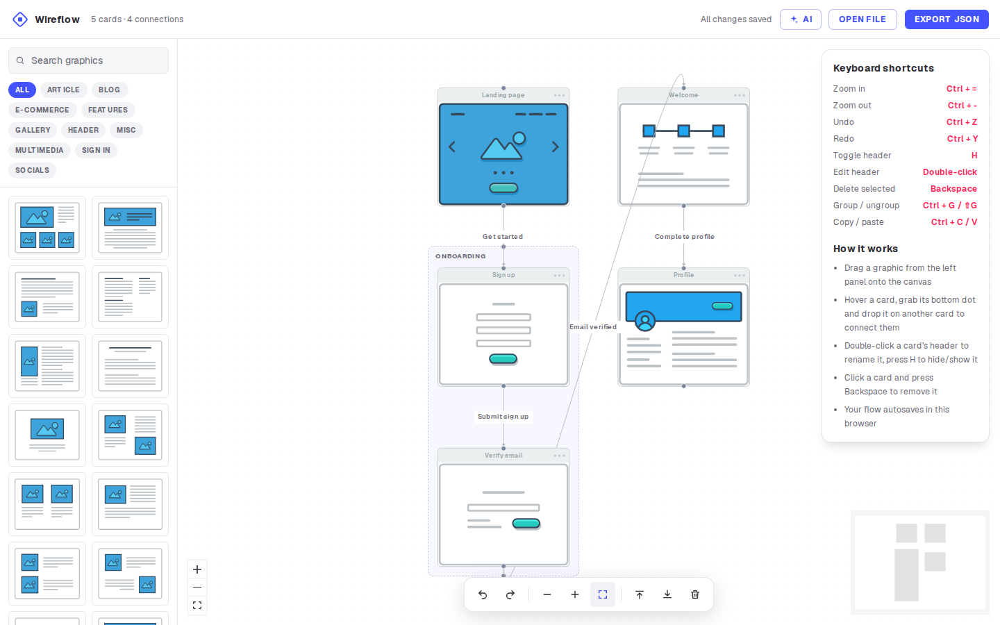

<p align="center">
  
</p>

<p align="center">
  <a href="LICENSE"></a>
  <a href="#backers"></a>
  <a href="#sponsors"></a>
</p>

<p align="center">
  <a href="https://wireflow.co"><b>Website</b></a> ·
  <a href="https://www.producthunt.com/posts/wireflow">Product Hunt</a>
</p>

Wireflow is a free, open-source tool for sketching user flows. Drag wireframe screens onto a canvas, connect them, and export the result as an image or save it to a file you can open again. The editor runs in the browser: no account, and your diagram never leaves your machine unless you use the optional AI assistant.

This repository is the app behind [wireflow.co](https://wireflow.co): a landing page at `/` and the editor at `/app`, built with Next.js and React Flow. It is a [Next.js](https://nextjs.org) project bootstrapped with [`create-next-app`](https://nextjs.org/docs/app/api-reference/cli/create-next-app) (the starter notes are at the end).

Made by [The Vanila Team](https://vanila.io) and [Automatio AI](https://automatio.ai).



## Features

- **125 screen templates** in twelve categories (Article, Blog, E-Commerce, Features, Gallery, Header, Misc, Multimedia, Sign in, Socials, Flow, Mobile), with category chips and a search that looks in every category. Drag the panel's right edge (or use the arrow keys on it) to make it wider or narrower; the thumbnails fill the columns that fit.
  - **Mobile:** 15 portrait phone screens (onboarding, sign in and up, home feed, list, detail, search, tab bar, menu, profile, chat, settings, cart, checkout, empty state). Their cards are 124 px wide instead of 220, so a phone screen is drawn at the same scale as a desktop one.
  - **Flow:** steps found in most flows: a yes / no choice, a three-way choice, email sent, email code and email confirmed, and wizard steps 1, 2 and 3.
- **Your own images**: "Your image" at the top of the templates (or an image file dropped on the canvas) adds any picture as a card, a phone screenshot or a sketch, at its own shape. It is scaled down in the browser and kept with the diagram, in the file too; Wireflow warns when the browser's storage (about 5 MB) is getting full.
- **Notes**: "Note" at the top of the templates adds a box of free text. Double-click it to write (several lines), drag its corners to resize it, and connect or group it like a card.
- **Estimates**: give a card its hours in the Card panel. Groups show their total, and the header shows the project's; it opens a breakdown per group where an hourly rate turns hours into cost. Project stages add work that isn't a screen (design, QA, project management): fixed hours, or a percentage of the cards' hours. The rate and the stages are saved with the diagram, and **Download CSV** saves the table (cards, groups, stages, totals, rate and cost) as `wireflow-estimate.csv`.
- **Drag and drop** templates onto a zoomable canvas, or tap one on a touch screen (a sideways swipe drags it).
- **Connect screens** from a card's bottom dot to another card. Each connection has its own label, line shape (smooth, polyline, rounded polyline), width (1 to 10 px) and colour.
- **Edit cards**: rename the header (double-click it, or in the Card panel), and hide or show it (H, Ctrl+H / Ctrl+K, or the panel).
- **Groups**: group a selection, nest groups, rename them, drag a card onto a group to add it or out of it to take it out. Ungroup keeps the cards; Delete removes the group with its cards.
- **Organize**: multi-select (a box), select all, bring to front and send to back. While two or more items are selected, a small "N selected · Clear" chip above the toolbar drops the selection in one click (so does Esc, or a click on empty canvas).
- **Edit history**: undo, redo, copy, paste (connections between copied cards come along) and delete. Undo survives a reload of the tab.
- **Navigate**: zoom in and out, fit to screen, actual size (1:1) and a minimap.
- **Export** the whole diagram as a JPG or PNG at twice the screen's pixel density, however large it is and whatever part of it is on screen.
- **Save and open files**: download the diagram as `wireflow.json` and open it again later, here or in another browser. Files from the earlier gg-editor app open too, with their groups.
- **Autosave**: every change is saved in your browser's `localStorage`.
- **AI assistant** (optional, bring your own Anthropic API key): describe a flow or a change in plain language and Claude edits the diagram, groups and notes included. It reads estimates, and changes them only when asked. Each change is one undo step. If you want, it remembers the key (encrypted) and keeps the chat after a reload.
- **Works offline and installs as an app** (PWA), once you have opened the editor online.

## How it works

<p align="center">
  
</p>

1. **Drag a screen.** Pick a template from the left sidebar and drop it on the canvas (or click it to add it).
2. **Connect the flow.** Hover a card, grab its bottom dot and drop it on another card. Select a card, connection or group to edit it in the panel on the right.
3. **Export.** Use the image button in the toolbar for a JPG or PNG of the whole diagram. You don't need to save; the diagram is stored in your browser as you work. To keep an editable copy or move it to another browser, use **Export JSON**, and **Open file** to load it back.

On screens narrower than 1400 px, the toolbar's less common commands (copy, paste, delete, actual size, arrange, multi-select, group, export image) are under **More tools**. On a phone, **AI**, **Open file** and the estimate are under the **More** button in the header, the toolbar scrolls sideways, and the panel for a selected card, note, group or connection is a sheet above the toolbar. The **Keyboard shortcuts** panel collapses from its heading and remembers that choice; in windows shorter than 941 px, where it would cover the minimap, it starts collapsed.

## Keyboard shortcuts

| Shortcut | Action |
| --- | --- |
| <kbd>Ctrl</kbd> + <kbd>=</kbd> / <kbd>Ctrl</kbd> + <kbd>-</kbd> | Zoom in / out |
| <kbd>Ctrl</kbd> + <kbd>0</kbd> | Actual size (1:1) |
| <kbd>Ctrl</kbd> + <kbd>Z</kbd> | Undo |
| <kbd>Ctrl</kbd> + <kbd>Y</kbd> or <kbd>Ctrl</kbd> + <kbd>Shift</kbd> + <kbd>Z</kbd> | Redo |
| <kbd>Ctrl</kbd> + <kbd>C</kbd> / <kbd>Ctrl</kbd> + <kbd>V</kbd> | Copy / paste the selected cards |
| <kbd>Delete</kbd> / <kbd>Backspace</kbd> | Delete the selection |
| <kbd>Ctrl</kbd> + <kbd>A</kbd> / <kbd>Esc</kbd> | Select everything / nothing (Esc also leaves multi-select mode) |
| <kbd>Ctrl</kbd> + <kbd>G</kbd> / <kbd>Ctrl</kbd> + <kbd>Shift</kbd> + <kbd>G</kbd> | Group the selection / ungroup the selected group |
| <kbd>H</kbd> | Hide or show the header of the selected cards |
| <kbd>Ctrl</kbd> + <kbd>H</kbd> / <kbd>Ctrl</kbd> + <kbd>K</kbd> | Hide / show the header of the selected cards |
| Double-click | Rename a card's header or a group |
| <kbd>Shift</kbd> + drag | Select with a box |

On a Mac, <kbd>Cmd</kbd> works wherever <kbd>Ctrl</kbd> is listed (except <kbd>Ctrl</kbd> + <kbd>H</kbd> / <kbd>K</kbd>). Shortcuts that would do nothing (Ctrl+G, H, Ctrl+H/K without a selection) are left to the browser.

## Offline and install

After one online visit to `/app`, the editor works offline. To get a window of its own, install it from the browser (in Chrome or Edge, the install icon in the address bar).

`scripts/build-sw.mjs` writes `public/sw.js` after `next build` (from `scripts/sw-template.js`): it controls `/app` only (never `/`, `/blog/*`, `/uploads/*` or other origins), precaches the build and the graphics, and refuses to cache an HTML page served for a script URL. A new deploy waits until the user clicks Reload in "A new version of Wireflow is available"; that reloads every open editor tab.

**Rollback:** build and deploy with `NEXT_PUBLIC_OFFLINE=off`. `/sw.js` then becomes a worker that deletes Wireflow's caches, unregisters itself and reloads open editor tabs. Keep serving that `/sw.js` for a while; deleting the file instead would leave installed browsers on their cached editor.

## Data and privacy

- **No accounts, no server storage.** The diagram autosaves in this browser's `localStorage["wireflow-flow-v1"]`, the key wireflow.co's editor has always used. Diagrams saved before these changes open unchanged. Saves add `"version": 4` (2 added groups and connection styles; 3 adds notes, your own images, estimates and the hourly rate; 4 adds project stages). An editor that knows an earlier version shows a newer diagram as far as it can but never saves over it; wireflow.co's current editor ignores the version.
- Every write goes through one save boundary (`lib/diagram/store.ts` → `lib/diagram/rules.ts`): connections need two existing cards, a card's group must exist and groups can't contain themselves, ids are unique strings, only known fields are kept (no `__proto__`), template image URLs come from the catalog, and your own images are only kept as JPEG, PNG or WebP data, never as links. If loading has to leave something out, or the stored data can't be read, the original is first copied to `wireflow-flow-v1.backup` (later copies get a time suffix). A diagram saved by a newer version is shown but never overwritten. Two open tabs follow each other's saves.
- The undo history of a tab is kept in `sessionStorage["wireflow-history-v1"]`, so it survives a reload of that tab.
- The autosaved diagram only exists in the browser where you made it, and clearing site data deletes it. To keep it or move it to another browser, use **Export JSON** and later **Open file**. Opening a file replaces the diagram on the canvas as one undo step (Wireflow asks first if the canvas isn't empty). An exported image is a picture of the diagram, not an editable file.
- **AI assistant** (the AI button, optional): bring your own Anthropic API key. Requests go straight from the browser to `api.anthropic.com` with your messages and a compact copy of the diagram (screen labels, template ids, positions, connections, groups, note text, estimates and the hourly rate; not your own images); Wireflow has no server in between and never sees them, and Anthropic's terms and your organization's data settings apply. Use a dedicated key with an expiry and a spend limit. Each reply shows its cost. Model output is shown as plain text.
  - **The key** is remembered on this device by default ("Remember on this device" starts ticked; untick it to keep the key only until the tab closes). It is stored **encrypted** in this browser's IndexedDB (database `wireflow-ai`): AES-GCM with a fresh IV each time, under a device key that WebCrypto creates as non-extractable, so its bytes can't be read or copied out, only used. That keeps the key out of plain sight in the browser's storage (devtools, storage exports, a copy of the storage files). It does not protect it from code running on the page, browser extensions or someone using this browser profile: they can have the browser decrypt it. **Forget key** deletes both records. A key an earlier version remembered in plain text (in `localStorage["wireflow-ai"]`) is encrypted the first time the panel opens, and the plain text deleted. Where the browser keeps no site data (or on plain http other than localhost, where WebCrypto is off), the key can't be remembered and the panel says so.
  - **The chat** is kept in memory, or also in the same IndexedDB database while **Keep chat after reload** is ticked (on by default; unticking it is remembered): the messages on screen and the conversation exactly as the next request sends it (answered requests only, never edited). It is not encrypted, like the diagram itself. **New chat**, **Forget key**, switching the model or unticking the box deletes it. There is one kept chat per browser, as there is one autosaved diagram; opening a file doesn't start a new chat, and the next request sends the diagram as it is then. `localStorage["wireflow-ai"]` keeps only the provider, the model and whether to keep the chat.
- Analytics load only when configured (see Environment variables). Apart from them and the AI assistant, the editor makes no third-party requests; the landing page shows Open Collective sponsor avatars.

## File format (Export JSON / Open file)

```json
{
  "format": "wireflow",
  "version": 4,
  "diagram": {
    "nodes": [
      { "id": "g1", "type": "group", "position": { "x": -16, "y": -36 }, "width": 572, "height": 270,
        "data": { "label": "Checkout" } },
      { "id": "…", "type": "flow", "parentId": "g1", "position": { "x": 16, "y": 36 },
        "data": { "graphicId": "e-commerce-cart", "label": "Cart", "headerText": "My cart", "showHeader": true,
                  "estimate": 6 } },
      { "id": "…", "type": "flow", "position": { "x": 620, "y": 0 },
        "data": { "graphicId": "own-image", "src": "data:image/jpeg;base64,…", "ratio": 2.16, "label": "Phone home" } },
      { "id": "…", "type": "note", "position": { "x": 620, "y": 520 }, "width": 220, "height": 120,
        "data": { "text": "Coupon field: optional" } }
    ],
    "edges": [{ "id": "…", "source": "…", "target": "…", "type": "smoothstep", "markerEnd": { "type": "arrowclosed" },
                "label": "Checkout", "style": { "stroke": "#e8590c", "strokeWidth": 3 } }],
    "settings": { "hourlyRate": 90, "currency": "EUR",
                  "stages": [{ "label": "Design", "percent": 20 }, { "label": "QA", "hours": 6 }] }
  }
}
```

- Cards name their template by the stable id in `lib/graphics.json`; image URLs are not stored and always come from this build. A card's size follows from its template (Mobile templates make 124 px wide portrait cards, the others 220 px), so it isn't stored either. A card with your own image (`"graphicId": "own-image"`) keeps the picture itself, scaled to at most 1280 px a side, and its height-to-width `ratio`.
- Notes (`"type": "note"`) keep their text (up to 2000 characters) and size. A card's `estimate` is in hours; `settings` holds the hourly rate, its currency and the project's stages (at most 50; each a name and either `hours` or a `percent` of the cards' hours).
- Groups are React Flow parent nodes: a member's `position` is relative to its group (`parentId`), and a group's frame always wraps its members. Connections join cards and notes.
- A connection's `type` is its line shape (`step`: polyline, `smoothstep`: rounded polyline; none: smooth) and `style.strokeWidth` its width (1 to 10; none: 2 px). A connection without a `style.stroke` is drawn #a3a8c3. The defaults are not stored.
- Open file also reads Export JSON from before version 2 (plain React Flow `{nodes, edges}`), the earlier gg-editor app's `{"format": "wireflow", "version": 1}` files with `Category/Name` template keys, and its plain G6 `{nodes, edges, groups}` (`lib/legacy-templates.json` maps all 102 old keys; layouts scale from 96 to 220 px cards; groups, line shapes and widths are kept).
- It refuses non-JSON, other formats, newer versions, bad or duplicate ids, missing positions, unknown templates, broken groups or group loops, more than 2000 items or 5 MB; asks before replacing a diagram; keeps the current one if storage refuses the new one; drops loose connections with a message.

## Quick start

Requirements: [Node.js](https://nodejs.org/) 20.9 or later (Node 24 LTS recommended; CI and the Docker image use 24) and npm.

```bash
git clone https://github.com/vanila-io/wireflow.git
cd wireflow
npm ci
npm run dev            # http://localhost:3000
```

## Develop and test

```bash
npm run lint
npm run typecheck
npm test               # Vitest unit tests (tests/unit)
npx playwright install chromium        # first run only
npm run test:e2e       # Playwright (e2e/): builds, then runs against next start on port 4410
E2E_SERVER=preview npm run test:e2e   # the same suite against the OpenNext Worker in workerd
npm run preview        # OpenNext build + local Cloudflare Workers runtime (wrangler dev)
```

| Command | What it does |
| --- | --- |
| `npm run dev` | Next.js dev server at http://localhost:3000 |
| `npm run build` | Production build (`next build`, then the offline worker `public/sw.js`) |
| `npm start` | Serve the production build (`next start`) |
| `npm run preview` | OpenNext build, served by the Workers runtime locally |
| `npm run deploy:staging` | OpenNext build, deployed to the `wireflow-staging` Worker |
| `npm run lint` / `npm run typecheck` | ESLint / TypeScript |
| `npm test` / `npm run test:e2e` | Vitest / Playwright |

- `E2E_PORT` picks another port; `E2E_SKIP_BUILD=1` reuses the last build; `E2E_BASE_URL=http://host:port` runs the suite against a server that is already running (for example an older commit, to see a test fail without its fix).
- Every e2e test fails on a console error or an uncaught page error, so the suite also checks that the Content-Security-Policy blocks nothing the app needs.
- Live AI test (spends real money, about $0.003 per run with Claude Haiku 5.5): `AI_LIVE=1 npx vitest run tests/unit/ai-live.test.ts`. It reads `ANTHROPIC_API_KEY` from the environment or `.env` (`AI_ENV_FILE` names another file) and never prints it.
- CI (`.github/workflows/ci.yml`) runs lint, typecheck, unit tests and the Cloudflare build; the e2e suite on Chromium against `next start` and against the Worker; and builds the Docker image and smoke-tests it.

## Environment variables

All optional; `.env.example` lists them, with the analytics values wireflow.co used. They are read at build time (the pages are prerendered), so set them in the build environment (or as Docker build args), not only as Worker vars.

| Variable | What it does |
| --- | --- |
| `NEXT_PUBLIC_GA_ID` | Google Analytics 4 measurement id (`G-…`). Unset: no GA script. |
| `NEXT_PUBLIC_RYBBIT_SRC` | URL of the self-hosted Rybbit script (`https://…/api/script.js`). Unset: no Rybbit script. |
| `NEXT_PUBLIC_RYBBIT_SITE_ID` | Rybbit site id; required with `NEXT_PUBLIC_RYBBIT_SRC`. |
| `CLOUDFLARE_WEB_ANALYTICS` | `1` if the Cloudflare zone injects its Web Analytics beacon, so the CSP allows it. |
| `BLOG_ORIGIN` | Origin of the Ghost blog. Set only if this app should proxy `/blog` and `/blog/*` there; production routes `/blog/*` to Ghost outside the app. |
| `NEXT_PUBLIC_OFFLINE` | `off` builds a worker that removes the offline editor from browsers that installed it (rollback, see Offline). |

A malformed analytics value fails the build instead of reaching the page. Rybbit's API key (`data-api-key`) is deliberately not supported: Rybbit documents it for tracking from localhost only, to be removed before deploying.

## Deploy

There are two ways to run Wireflow in production; both build the same app from the same `next.config.ts`.

### Cloudflare Workers (OpenNext)

- `npm run preview` builds with `@opennextjs/cloudflare` and serves the Worker locally (bindings simulated).
- `npm run deploy:staging` deploys the Worker `wireflow-staging`. The top level of `wrangler.jsonc` is staging too, so a plain `wrangler deploy` can't replace production.
- Bindings: `ASSETS` (static assets), `NEXT_INC_CACHE_R2_BUCKET` (R2 incremental cache: `/` revalidates hourly) and `WORKER_SELF_REFERENCE` (a service binding to the Worker itself, for the revalidation queue). Uploads (`lib/storage.js`, `/uploads/*`) need an R2 binding `STORAGE` and optionally a `SITE_PREFIX` var; not bound, as nothing in the app uploads today, so `/uploads/*` answers 404.
- Owner TODOs before production:
  - fill in `env.production` in `wrangler.jsonc` (the Worker's name, routes, cache bucket; `STORAGE` if uploads are used) from the Cloudflare dashboard; its placeholders are invalid on purpose, so a deploy fails until then; deploy only with an explicit `opennextjs-cloudflare deploy --env production`;
  - create the staging cache bucket: `wrangler r2 bucket create wireflow-staging-opennext-cache`;
  - set the analytics variables in the build environment;
  - keep the `/blog/*` route to Ghost, or set `BLOG_ORIGIN`.

### Docker

```bash
docker compose up -d --build     # http://localhost:8083
docker compose down
```

The image builds the app with Node 24 (`npm ci && npm run build`, which also writes the offline worker `public/sw.js`) and runs the Next.js production server from the standalone output (`output: "standalone"` in `next.config.ts`) as an unprivileged user on port 3000. Compose maps that port to 8083, as before.

Settings read at build time are build args: `NEXT_PUBLIC_GA_ID`, `NEXT_PUBLIC_RYBBIT_SRC`, `NEXT_PUBLIC_RYBBIT_SITE_ID`, `CLOUDFLARE_WEB_ANALYTICS`, `BLOG_ORIGIN` and `NEXT_PUBLIC_OFFLINE`. Compose takes them from your shell or a `.env` file, for example `NEXT_PUBLIC_GA_ID=G-… docker compose up -d --build`. Without them the site loads no analytics.

Everything the editor needs works in the container: `/`, `/app`, the offline worker, the templates and the security headers. Differences from the Cloudflare deploy:

- **Sponsors:** `/` lists Open Collective sponsors, fetched during `docker build` and refreshed hourly. The cached page is kept on the container's disk (not in R2), so it starts again from the image's copy when the container is recreated. If Open Collective can't be reached during the build, the page shows no sponsors until the next refresh.
- **Uploads:** `lib/storage.js` supports Cloudflare R2 (the `STORAGE` binding) or a sandbox proxy only, and `@opennextjs/cloudflare` is not in the image, so `/uploads/*` answers 404 in Docker, as it does on a Worker without that binding. Nothing in the app uploads files today.
- **Blog:** `/blog` is served by Ghost outside this app. Set `BLOG_ORIGIN` at build time if this server should proxy it.

`output: "standalone"` is what OpenNext's Cloudflare build sets by itself (`NEXT_PRIVATE_STANDALONE`), so it changes nothing there, and `npm start` still works.

## Tech stack

[Next.js 16](https://nextjs.org/) · [React 19](https://react.dev/) · [React Flow](https://reactflow.dev/) (`@xyflow/react`) · [Tailwind CSS 4](https://tailwindcss.com/) · [Radix UI](https://www.radix-ui.com/) · [Lucide](https://lucide.dev/) · [html-to-image](https://github.com/bubkoo/html-to-image) · [Anthropic SDK](https://github.com/anthropics/anthropic-sdk-typescript) · [OpenNext for Cloudflare](https://opennext.js.org/cloudflare) · [Vitest](https://vitest.dev/) · [Playwright](https://playwright.dev/) · [ESLint](https://eslint.org/)

## Project structure

```text
.
├── app/                  Next.js routes: landing page (/), editor (/app), manifest, /uploads
├── components/
│   ├── landing/          landing page sections
│   ├── editor/           the editor: canvas, cards, groups, sidebar, toolbar, panels, export
│   └── ai/               AI assistant panel
├── lib/
│   ├── diagram/          the diagram store, rules, groups, history, storage, file format, old-file converter
│   ├── ai/               AI assistant: catalog, diagram edits and layout checks, agent loop, providers
│   └── graphics.json     the screen templates (images in public/graphics/)
├── public/               static files (icons, robots.txt, graphics)
├── scripts/              build helpers (offline worker, icons, graphic sizes)
├── tests/unit/           Vitest tests
├── e2e/                  Playwright tests
├── docs/                 README images
├── Dockerfile            Node 24 build + Next.js standalone server
├── docker-compose.yml    serves the app on port 8083
├── wrangler.jsonc        Cloudflare Worker (OpenNext): staging, and production to fill in
└── open-next.config.ts   OpenNext settings (R2 incremental cache)
```

## Contributing

Contributions are welcome. Bug reports and ideas go in [GitHub issues](https://github.com/vanila-io/wireflow/issues).

1. Fork the repository and create a branch for your change.
2. Install dependencies with `npm ci` and make your change.
3. Run the checks locally:

   ```bash
   npm run lint && npm run typecheck && npm test && npm run test:e2e
   ```

4. Open a pull request that explains what changed and why. Include a screenshot for UI changes.

## Around the web

- [Wireflow website](https://wireflow.co)
- [Product Hunt page](https://www.producthunt.com/posts/wireflow)
- [Open Hub analysis of the code](https://www.openhub.net/p/wireflow)
- [Original call for contributors (Meteor forums)](https://forums.meteor.com/t/anyone-interested-in-collaboration-on-wireflow-co-open-source-project/40716)
- [Slack invite](https://join.slack.com/t/wireflow/shared_invite/zt-iwgx8efa-Vt~_rnkw2tGAhSR~nJs9bA) (older invite link, may have expired)

## Credits

### Contributors

This project exists thanks to everyone who contributes.

<a href="https://github.com/vanila-io/wireflow/graphs/contributors"></a>

### Backers

Thank you to all our backers! [Become a backer](https://opencollective.com/wireflow#backer)

<a href="https://opencollective.com/wireflow#backer" target="_blank"></a>

### Sponsors

Support this project by becoming a sponsor. Your logo will show up here with a link to your website. [Become a sponsor](https://opencollective.com/wireflow#sponsor)

<a href="https://opencollective.com/wireflow/sponsor/0/website" target="_blank"></a>
<a href="https://opencollective.com/wireflow/sponsor/1/website" target="_blank"></a>
<a href="https://opencollective.com/wireflow/sponsor/2/website" target="_blank"></a>

## License

[MIT](LICENSE)

---

## Next.js starter notes

The notes `create-next-app` wrote for this project, kept as they were.

### Getting Started

First, run the development server:

```bash
npm run dev
# or
yarn dev
# or
pnpm dev
# or
bun dev
```

Open [http://localhost:3000](http://localhost:3000) with your browser to see the result.

You can start editing the page by modifying `app/page.tsx`. The page auto-updates as you edit the file.

This project uses [`next/font`](https://nextjs.org/docs/app/building-your-application/optimizing/fonts) to automatically optimize and load [Geist](https://vercel.com/font), a new font family for Vercel.

### Learn More

To learn more about Next.js, take a look at the following resources:

- [Next.js Documentation](https://nextjs.org/docs) - learn about Next.js features and API.
- [Learn Next.js](https://nextjs.org/learn) - an interactive Next.js tutorial.

You can check out [the Next.js GitHub repository](https://github.com/vercel/next.js) - your feedback and contributions are welcome!

### Deploy on Vercel

The easiest way to deploy your Next.js app is to use the [Vercel Platform](https://vercel.com/new?utm_medium=default-template&filter=next.js&utm_source=create-next-app&utm_campaign=create-next-app-readme) from the creators of Next.js.

Check out our [Next.js deployment documentation](https://nextjs.org/docs/app/building-your-application/deploying) for more details.
